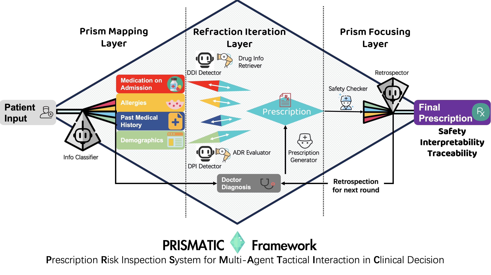

# PRISMATIC: ***P***rescription ***R***isk ***I***nspection ***S***ystem for ***M***ulti-***A***gent ***T***actical ***I***nteraction in ***C***linical Decision



## A multi-agent architecture leveraging patient statements and clinical knowledge for prescription risk inspection. 

- <b>Prism Mapping Layer</b> for information extraction and classification from patient input.
- <b>Refraction Iteration Layer</b> where multiple agents (e.g., DDI Detector, DPI Detector) collaboratively refine a prescription based on extracted information and clinical rules.
- <b>Prism Focusing Layer</b> for final safety checks and interpretability analysis. 
- <b>Retrospection mechanism</b> enables continuous learning and improvement of the system.

## Setup Instructions

This project uses [Poetry](https://python-poetry.org/) to manage dependencies and the virtual environment.

### 1. Install Poetry

You can install Poetry via `pip`:

```bash
pip install poetry
```
Or using the official installer (recommended):
```bash
curl -sSL https://install.python-poetry.org | python3 -
```

### 2. Install Dependencies
Clone & Navigate to the project directory and run:
```bash
git clone https://github.com/ZaneLing/PharmAid.git
cd PharmAid
poetry install
```
This will install all required packages and set up a virtual environment.

### 3. Set OpenAI API Key
Open .env file and set your OpenAI API key as an environment variable:
```bash
OPENAI_API_KEY = 'your_api_key'
```
### 4. Run the Workflow
To execute the main script within the Poetry environment, run:
```bash
poetry run python workflow.py
```